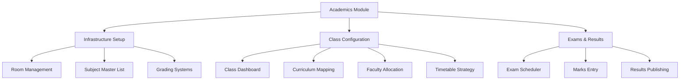
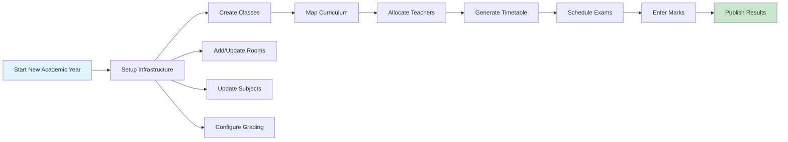

# Academic Coordinator Frontend Guide

**Version**: 2.0  
**Last Updated**: January 19, 2026  
**Role Overview**: The Academic Coordinator is the architect of the school's educational structure. Their dashboard allows them to define _what_ is taught, _who_ teaches it, _where_ it happens, and _how_ it is evaluated.

This document describes the functional requirements, user flows, technical implementation details, and best practices for the Academic Coordinator's Frontend Module.

---

## Table of Contents

1. [Module Overview](#module-overview)
2. [Infrastructure Setup](#1-module-infrastructure-setup-the-foundation)
3. [Class Configuration Hub](#2-module-class-configuration-hub-the-core)
4. [Examination & Results](#3-module-examination--results)
5. [User Flow Summary](#4-user-flow-summary-setting-up-a-new-academic-year)
6. [Technical Implementation](#5-technical-implementation)
7. [Data Models](#6-data-models)
8. [UI/UX Guidelines](#7-uiux-guidelines)
9. [Validation Rules](#8-validation-rules)
10. [Future Enhancements](#9-future-enhancements)

---

## Module Overview

The Academics module is structured into three primary sections:



### Key Principles

- **Progressive Disclosure**: Complex features are revealed step-by-step
- **Data Integrity**: Validation at every step prevents inconsistent data
- **Flexibility**: Support for multiple boards (CBSE, IGCSE, etc.)
- **Audit Trail**: Track who made changes and when
- **User-Centric**: Designed for non-technical academic staff

---

## 1. Module: Infrastructure Setup (The Foundation)

_Before classes or exams can be created, the basic building blocks must be defined._

### A. Room Management

**Goal**: Digitize the school's physical infrastructure.

**Route**: `/academics/infrastructure/rooms`

**Components**:
- `Rooms.jsx` - Main container with table view
- `RoomModal.jsx` - Form for creating/editing rooms

**UI Elements**:
- **Data Table** with sortable columns and search functionality
- **"Add Room" Button** - Opens modal dialog
- **Action Buttons** - Edit (pencil icon), Delete (trash icon)

**Fields**:
| Field | Type | Validation | Example |
|-------|------|------------|---------|
| `Room Number/Name` | Text | Required, Unique | "101", "Chemistry Lab A" |
| `Type` | Dropdown | Required | Classroom, Lab, Library, Hall, Auditorium, Sports Room |
| `Capacity` | Number | Required, Min: 1, Max: 500 | 40 |
| `Floor` | Number | Optional | 1, 2, 3 |
| `Building` | Text | Optional | "Main Block", "Science Wing" |
| `Facilities` | Multi-select | Optional | Projector, AC, Smart Board, Lab Equipment |
| `Status` | Toggle | Default: Active | Active, Under Maintenance, Closed |

**Actions**:
- **Create**: Add new room with validation
- **Edit**: Modify existing room details
- **Delete**: Soft delete with confirmation dialog
- **Bulk Import**: CSV upload for multiple rooms (Future)

**Validation Rules**:
- Room number must be unique within the school
- Capacity must be a positive integer
- Cannot delete rooms that are assigned to classes or timetables

**Mock Data Structure**:
```javascript
{
  id: "R001",
  roomNumber: "101",
  type: "Classroom",
  capacity: 40,
  floor: 1,
  building: "Main Block",
  facilities: ["Projector", "AC"],
  status: "Active",
  createdAt: "2026-01-15T10:00:00Z",
  updatedAt: "2026-01-15T10:00:00Z"
}
```

---

### B. Subject Master List

**Goal**: Create a global repository of all subjects offered in the school (across all grades and boards).

**Route**: `/academics/infrastructure/subjects`

**Components**:
- `Subjects.jsx` - Main container
- `SubjectList.jsx` - Table view with search
- `SubjectForm.jsx` - Modal form for add/edit

**UI Elements**:
- **Searchable Grid/Table** - Filter by name, code, or type
- **Add Subject Button** - Opens modal
- **Filter Chips** - Quick filter by subject type or department
- **Bulk Actions** - Select multiple subjects for batch operations

**Fields for Creation**:
| Field | Type | Validation | Example |
|-------|------|------------|---------|
| `Subject Name` | Text | Required, Min: 2 chars | "Physics", "Mathematics" |
| `Subject Code` | Text | Required, Unique, Alphanumeric | "PHY01", "MAT-10" |
| `Subject Type` | Dropdown | Required | Theory, Practical, Co-Scholastic, Language, Elective |
| `Department` | Dropdown | Optional | Science, Mathematics, Languages, Arts, Sports |
| `Description` | Textarea | Optional | Brief description of the subject |
| `Credit Hours` | Number | Optional, Default: 1 | 1, 2, 3 (weekly weightage) |
| `Board` | Multi-select | Optional | CBSE, IGCSE, IB, State Board |

**Advanced Features**:
- **Subject Groups**: Link related subjects (e.g., Physics Theory + Physics Practical)
- **Prerequisites**: Define subject dependencies (e.g., Advanced Math requires Basic Math)
- **Tags**: Custom labels for organization (e.g., "STEM", "Core", "Optional")

**Mock Data Structure**:
```javascript
{
  id: "SUB001",
  name: "Physics",
  code: "PHY01",
  type: "Theory",
  department: "Science",
  description: "Introduction to Physics concepts",
  creditHours: 3,
  boards: ["CBSE", "IGCSE"],
  prerequisites: [],
  tags: ["STEM", "Core"],
  isActive: true,
  createdAt: "2026-01-10T09:00:00Z"
}
```

---

### C. Grading Systems (Crucial)

**Goal**: Define how students are assessed. Since the school may have multiple boards (CBSE, IGCSE), this system must be flexible.

**Route**: `/academics/infrastructure/grading`

**Components**:
- `GradingSystems.jsx` - Main container
- `GradingScaleList.jsx` - List of all grading scales
- `GradingScaleBuilder.jsx` - Rule builder interface

**UI Elements**:
- **Rule Builder** - Dynamic form with add/remove rows
- **Preview Panel** - Live preview of grade distribution
- **Template Library** - Pre-built scales (CBSE 10-point, Percentage, GPA 4.0)

**Capabilities**:

#### Step 1: Create Scale
- **Scale Name**: e.g., "CBSE Secondary 2024", "IGCSE Grading 2025"
- **Academic Year**: Link to specific year
- **Board**: CBSE, IGCSE, IB, etc.
- **Description**: Optional notes

#### Step 2: Type Selection
| Type | Description | Use Case |
|------|-------------|----------|
| **Percentage-based** | 0-100% scale | Traditional Indian schools |
| **Point-based (GPA)** | 0-10 or 0-4 scale | CBSE 10-point, US GPA |
| **Grade-only** | Letter grades (A+, A, B+, etc.) | IGCSE, IB |
| **Hybrid** | Combination of above | Custom requirements |

#### Step 3: Define Rules
**Dynamic rows to add grade ranges**:

| Grade | Min | Max | Points | Remarks | Actions |
|-------|-----|-----|--------|---------|---------|
| A1 | 91 | 100 | 10 | Outstanding | 🗑️ |
| A2 | 81 | 90 | 9 | Excellent | 🗑️ |
| B1 | 71 | 80 | 8 | Very Good | 🗑️ |
| ... | ... | ... | ... | ... | ... |

**Validation**:
- No gaps between ranges
- No overlapping ranges
- Min < Max for each row
- Covers full range (0-100 for percentage, 0-10 for GPA)

**Usage**: These scales will later be linked to specific Exams.

**Mock Data Structure**:
```javascript
{
  id: "GS001",
  name: "CBSE Secondary 2024",
  type: "Point-based",
  board: "CBSE",
  academicYear: "2024-2025",
  rules: [
    { grade: "A1", min: 91, max: 100, points: 10, remarks: "Outstanding" },
    { grade: "A2", min: 81, max: 90, points: 9, remarks: "Excellent" },
    // ... more rules
  ],
  isDefault: true,
  createdAt: "2026-01-05T08:00:00Z"
}
```

---

## 2. Module: Class Configuration Hub (The Core)

_The central workspace for managing the academic year structure._

### A. Class Management Dashboard

**Route**: `/academics/class-configuration`

**Components**:
- `ClassConfiguration.jsx` - Main container
- `ClassList.jsx` - Grid/table view of all classes
- `ClassForm.jsx` - Modal for creating/editing classes

**View**: Grid or Table view of all classes

**Display Columns**:
- Class Name (e.g., "Grade 10-A")
- Grade Level
- Section
- Program/Board (CBSE/IGCSE)
- Class Teacher
- Total Students
- Default Room
- Status (Active/Inactive)
- Actions (View, Edit, Delete)

**Create Class Action**:

**Fields**:
| Field | Type | Validation | Example |
|-------|------|------------|---------|
| `Class Name` | Text | Auto-generated or Manual | "10-A", "Grade 10 Section A" |
| `Grade Level` | Dropdown | Required | 1-12, Pre-K, Kindergarten |
| `Section` | Text | Required, Single char | A, B, C, D |
| `Program/Board` | Dropdown | Required | CBSE, IGCSE, IB, State Board |
| `Academic Year` | Dropdown | Required | 2024-2025, 2025-2026 |
| `Class Teacher` | Dropdown | Required | Select from active teachers |
| `Default Room` | Dropdown | Optional | Select from available rooms |
| `Max Strength` | Number | Optional | 40, 50 |
| `Medium` | Dropdown | Optional | English, Hindi, Regional |

**Assignment**:
- **Class Teacher**: Dropdown populated from HR module (teachers only)
- **Default Room**: Dropdown from Room Management
- **Validation**: Prevent duplicate class names within same academic year

**Mock Data Structure**:
```javascript
{
  id: "CLS001",
  name: "10-A",
  gradeLevel: 10,
  section: "A",
  board: "CBSE",
  academicYear: "2024-2025",
  classTeacher: {
    id: "T001",
    name: "Mrs. Sharma"
  },
  defaultRoom: {
    id: "R101",
    roomNumber: "101"
  },
  maxStrength: 40,
  currentStrength: 38,
  medium: "English",
  status: "Active",
  createdAt: "2026-01-08T10:00:00Z"
}
```

---

### B. Inside a Class: The 3-Step Configuration

**Route**: `/academics/classes/:classId`

**Component**: `ClassDetails.jsx`

_When a coordinator clicks on a class (e.g., 10-A), they enter a detailed view with three tabs:_

#### Tab 1: Curriculum (Subject Mapping)

**Component**: `CurriculumTab.jsx`

**Goal**: Define what these students will study this year.

**UI Layout**:
- **Header**: Class name, grade, section
- **Subject List**: Table of mapped subjects
- **Add Subject Button**: Opens subject selection modal

**Action**: "Add Subject" Button

**Interaction**: 
1. Click "Add Subject"
2. Modal opens with searchable subject list (from Subject Master)
3. Select subject(s) - supports multi-select
4. Configure subject settings

**Configuration**:
| Field | Type | Description |
|-------|------|-------------|
| **Subject** | Dropdown | From Subject Master List |
| **Mandatory vs. Elective** | Toggle | Required or optional for students |
| **Credit Hours** | Number | Weekly hours allocated |
| **Exam Type** | Dropdown | Theory, Practical, Both, None |
| **Weightage** | Number | Percentage in final grade (if applicable) |
| **Start Date** | Date | When subject teaching begins |
| **End Date** | Date | When subject teaching ends |

**Table View**:
| Subject | Code | Type | Mandatory | Credits | Exam Type | Faculty | Actions |
|---------|------|------|-----------|---------|-----------|---------|---------|
| Mathematics | MAT01 | Theory | ✓ | 6 | Theory | Not Assigned | ✏️ 🗑️ |
| Physics | PHY01 | Theory | ✓ | 5 | Both | Mr. Kumar | ✏️ 🗑️ |
| ... | ... | ... | ... | ... | ... | ... | ... |

**Outcome**: This generates the `ClassSubjectMapping` data model.

**Validation**:
- Total credit hours should not exceed weekly limit (e.g., 40 hours)
- At least one mandatory subject must be assigned
- Cannot remove subjects that have scheduled exams or timetable entries

---

#### Tab 2: Faculty Allocation (The Matrix)

**Component**: `FacultyAllocationTab.jsx`

**Goal**: Assign teachers to the subjects defined in Tab 1.

**UI Layout**: Clean table/matrix view

**Table Structure**:
| Subject | Subject Code | Type | Assigned Faculty | Department | Actions |
|---------|--------------|------|------------------|------------|---------|
| Mathematics | MAT01 | Theory | [Dropdown: Select Teacher] | Mathematics | ✏️ |
| Physics | PHY01 | Theory | Mr. Kumar | Science | ✏️ |
| Chemistry | CHE01 | Practical | Mrs. Patel | Science | ✏️ |

**Smart Features**:
1. **Department Filtering**: Dropdown only shows teachers from relevant department
2. **Conflict Detection**: 
   - Warning icon if teacher is already assigned to another class in same time slot
   - Shows teacher's current workload (total classes/week)
3. **Workload Indicator**: Color-coded badges
   - 🟢 Green: < 20 hours/week
   - 🟡 Yellow: 20-30 hours/week
   - 🔴 Red: > 30 hours/week
4. **Quick Assign**: Bulk assign one teacher to multiple subjects
5. **Teacher Profile**: Click teacher name to see their full schedule

**Validation**:
- Cannot assign inactive teachers
- Warning if teacher's total weekly hours exceed threshold
- Cannot assign teacher to subject outside their expertise (soft warning)

---

#### Tab 3: Timetable Strategy

**Component**: `TimetableTab.jsx`

**Goal**: Schedule the weekly class timetable.

**UI Layout**: Interactive Weekly Calendar

**Calendar Structure**:
```
        Monday    Tuesday   Wednesday  Thursday   Friday    Saturday
8:00    [Math]    [Eng]     [Sci]      [Math]    [Eng]     [Sports]
9:00    [Sci]     [Math]    [Eng]      [Sci]     [Math]    [Library]
10:00   [BREAK - Recess]
10:30   [Hist]    [Geo]     [Math]     [Eng]     [Sci]     [Assembly]
...
```

**Interaction**:
1. **Drag and Drop**: 
   - Sidebar shows all subjects assigned to this class
   - Drag subject onto time slot
   - Visual feedback on valid/invalid drop zones
2. **Time Slot Configuration**:
   - Set school start/end time
   - Define period duration (e.g., 45 min, 1 hour)
   - Add breaks (Recess, Lunch)
3. **Auto-Schedule** (Advanced):
   - AI-powered suggestion based on:
     - Teacher availability
     - Room availability
     - Subject credit hours
     - Best practices (e.g., Math in morning)

**Validation**:
- **Teacher Conflict**: Cannot schedule same teacher in two places at once
- **Room Conflict**: Cannot double-book a room
- **Credit Hours**: Warning if subject hours don't match allocated credits
- **Consecutive Limits**: Warning if same subject scheduled 3+ times in a row

**Visual Indicators**:
- 🟢 Valid slot
- 🔴 Conflict detected
- 🟡 Warning (e.g., teacher has back-to-back classes)
- 🔵 Break time

**Export Options**:
- PDF printout for teachers
- PDF printout for students
- Excel export
- Share via email

**Mock Data Structure**:
```javascript
{
  classId: "CLS001",
  academicYear: "2024-2025",
  schedule: [
    {
      day: "Monday",
      slots: [
        {
          startTime: "08:00",
          endTime: "08:45",
          subject: { id: "SUB001", name: "Mathematics" },
          teacher: { id: "T001", name: "Mr. Kumar" },
          room: { id: "R101", roomNumber: "101" },
          type: "Regular"
        },
        // ... more slots
      ]
    },
    // ... more days
  ],
  breaks: [
    { day: "All", startTime: "10:00", endTime: "10:30", name: "Recess" },
    { day: "All", startTime: "13:00", endTime: "13:45", name: "Lunch" }
  ],
  createdAt: "2026-01-12T09:00:00Z",
  lastModified: "2026-01-15T14:30:00Z"
}
```

---

## 3. Module: Examination & Results

_Managing the assessment lifecycle._

### A. Exam Scheduler

**Route**: `/academics/exams/schedule`

**Component**: `ExamScheduler.jsx`

**Goal**: Plan an exam event (e.g., "Term 1 Finals", "Unit Test 1").

**Multi-Step Form**:

#### Step 1: Basic Information
| Field | Type | Validation | Example |
|-------|------|------------|---------|
| `Exam Name` | Text | Required | "Term 1 Finals", "Half Yearly" |
| `Exam Type` | Dropdown | Required | Term Exam, Unit Test, Pre-Board, Mock Test |
| `Start Date` | Date | Required | 2026-03-01 |
| `End Date` | Date | Required, >= Start Date | 2026-03-15 |
| `Academic Year` | Dropdown | Required | 2024-2025 |
| `Description` | Textarea | Optional | Additional notes |

#### Step 2: Participants
**UI**: Checkbox tree or multi-select

**Options**:
- Select All Classes
- Select by Grade (e.g., All Grade 10)
- Select by Board (e.g., All CBSE classes)
- Individual class selection

**Display**: Shows selected classes with student count

#### Step 3: Grading Logic
**Select Grading Scale**: Dropdown from Grading Systems module

**Preview**: Shows grade distribution rules

**Options**:
- Use different scales for different grades (Advanced)
- Override passing marks

#### Step 4: Paper Definition
**For each subject type** (Theory/Practical):

| Field | Type | Validation | Example |
|-------|------|------------|---------|
| `Max Marks` | Number | Required, > 0 | 80, 100 |
| `Passing Marks` | Number | Required, < Max Marks | 27, 33 |
| `Exam Date` | Date | Within exam date range | 2026-03-05 |
| `Start Time` | Time | Required | 09:00 AM |
| `Duration` | Number (minutes) | Required | 180 (3 hours) |
| `Room` | Dropdown | Optional | Exam Hall A |
| `Invigilator` | Dropdown | Optional | Mr. Sharma |

**Advanced Options**:
- **Weightage**: Percentage contribution to final grade
- **Question Paper Code**: For multiple sets
- **Special Instructions**: For students/teachers

**Review & Publish**:
- Summary of all exam details
- Conflict check (room/teacher availability)
- Publish button to finalize

**Mock Data Structure**:
```javascript
{
  id: "EX001",
  name: "Term 1 Finals",
  type: "Term Exam",
  startDate: "2026-03-01",
  endDate: "2026-03-15",
  academicYear: "2024-2025",
  classes: ["CLS001", "CLS002", "CLS003"],
  gradingScale: "GS001",
  papers: [
    {
      subject: "SUB001",
      type: "Theory",
      maxMarks: 80,
      passingMarks: 27,
      examDate: "2026-03-05",
      startTime: "09:00",
      duration: 180,
      room: "R201",
      invigilator: "T005",
      weightage: 70
    },
    // ... more papers
  ],
  status: "Scheduled", // Draft, Scheduled, In Progress, Completed
  createdBy: "AC001",
  createdAt: "2026-02-15T10:00:00Z"
}
```

---

### B. Marks & Result Management

**Routes**: 
- `/academics/exams/marks-entry`
- `/academics/exams/results`

**Components**:
- `MarksEntry.jsx` - Grid for entering marks
- `ExamsResults.jsx` - Dashboard for viewing results

#### Marks Entry Interface

**Goal**: Oversee and facilitate the grading process.

**Status Dashboard**:
| Exam | Class | Subject | Papers | Marks Entered | Finalized | Status |
|------|-------|---------|--------|---------------|-----------|--------|
| Term 1 Finals | 10-A | Mathematics | 2 | 38/40 | ✓ | Completed |
| Term 1 Finals | 10-A | Physics | 2 | 25/40 | ✗ | In Progress |
| ... | ... | ... | ... | ... | ... | ... |

**Marks Entry Grid**:

**Selection Flow**:
1. Select Exam (Dropdown)
2. Select Class (Dropdown)
3. Select Subject (Dropdown)
4. Select Paper Type (Theory/Practical)

**Grid View**: Excel-like interface

| Roll No | Student Name | Theory (80) | Practical (20) | Total (100) | Grade | Remarks | Status |
|---------|--------------|-------------|----------------|-------------|-------|---------|--------|
| 1 | Aarav Kumar | 72 | 18 | 90 | A1 | - | ✓ |
| 2 | Priya Sharma | 65 | 16 | 81 | A2 | - | ✓ |
| 3 | Rahul Patel | AB | AB | AB | AB | Absent | ✓ |
| ... | ... | ... | ... | ... | ... | ... | ... |

**Features**:
- **Auto-save**: Saves every 30 seconds or on blur
- **Validation**: 
  - Marks cannot exceed max marks
  - Highlights invalid entries in red
  - Warning for marks below passing threshold
- **Bulk Actions**:
  - Mark multiple students as Absent (AB)
  - Copy marks from previous exam (for re-tests)
- **Grade Calculation**: Auto-calculates based on grading scale
- **Remarks**: Optional notes for each student
- **Finalize Button**: Locks marks (requires confirmation)
- **Export**: Download as Excel/PDF

**Permissions**:
- Subject teachers can enter marks for their subjects
- Academic Coordinator can edit all marks
- Once finalized, only Coordinator can unlock

#### Result Publishing

**Goal**: Generate and distribute report cards.

**Status Indicators**:
- 🔴 Not Started
- 🟡 In Progress (some marks pending)
- 🟢 Ready to Publish (all marks entered)
- 🔵 Published

**Actions**:
1. **Verify Data**: Run validation checks
   - All marks entered
   - All grades calculated
   - No invalid entries
2. **Generate Report Cards**: 
   - PDF generation for each student
   - Includes: Student details, subject-wise marks, grades, overall percentage/GPA, remarks
3. **Publish**: 
   - Make visible to students/parents via portal
   - Send email notifications
   - Lock marks from further editing
4. **Bulk Download**: Download all report cards as ZIP

**Analytics Dashboard**:
- Class-wise performance
- Subject-wise average
- Pass/Fail statistics
- Grade distribution chart
- Comparison with previous exams

---

## 4. User Flow Summary: Setting up a New Academic Year



### Detailed Steps:

1. **Setup Infrastructure** (Week 1)
   - ✅ Ensure new rooms or updated grading logic are added
   - ✅ Review and update Subject Master List
   - ✅ Configure grading scales for new academic year
   - ✅ Verify room capacities and facilities

2. **Create Classes** (Week 2)
   - ✅ Create classes specific to the new year (e.g., "Class of 2025")
   - ✅ Assign class teachers
   - ✅ Set default rooms
   - ✅ Define max strength

3. **Map Curriculum** (Week 3)
   - ✅ Define subjects for each class
   - ✅ Mark mandatory vs. elective subjects
   - ✅ Assign credit hours
   - ✅ Configure exam types

4. **Allocate Teachers** (Week 4)
   - ✅ Assign subject teachers to each class
   - ✅ Verify teacher workload
   - ✅ Resolve scheduling conflicts

5. **Generate Timetable** (Week 5-6)
   - ✅ Create weekly schedule for each class
   - ✅ Ensure no teacher/room conflicts
   - ✅ Balance subject distribution
   - ✅ Export and distribute timetables

6. **Schedule Exams** (Throughout the year)
   - ✅ Create exam events (Term 1, Term 2, etc.)
   - ✅ Define exam papers and dates
   - ✅ Assign invigilators and rooms
   - ✅ Publish exam schedule

7. **Marks Entry & Results** (After each exam)
   - ✅ Enter marks for all subjects
   - ✅ Verify data accuracy
   - ✅ Generate report cards
   - ✅ Publish results to students/parents

---

## 5. Technical Implementation

### Technology Stack

**Frontend**:
- React 18+ with Hooks
- React Router for navigation
- Tailwind CSS for styling
- Lucide React for icons
- React DnD for drag-and-drop (timetable)
- Recharts for analytics
- Date-fns for date manipulation

**State Management**:
- Local state with `useState` for component-level data
- Context API for shared state (e.g., selected class)
- LocalStorage for mock data persistence

**Form Handling**:
- Controlled components
- Custom validation hooks
- Error boundary for graceful error handling

### File Structure

```
src/pages/Academics/
├── Academics.jsx                 # Main landing page
├── Infrastructure/
│   ├── Rooms.jsx                # Room management container
│   ├── RoomModal.jsx            # Room form modal
│   ├── Subjects.jsx             # Subject management container
│   ├── SubjectList.jsx          # Subject table view
│   ├── SubjectForm.jsx          # Subject form modal
│   ├── GradingSystems.jsx       # Grading systems container
│   ├── GradingScaleList.jsx     # List of grading scales
│   └── GradingScaleBuilder.jsx  # Rule builder interface
├── ClassConfiguration/
│   ├── ClassConfiguration.jsx   # Class dashboard
│   ├── ClassList.jsx            # Class table view
│   ├── ClassForm.jsx            # Class creation form
│   ├── ClassDetails.jsx         # Class detail view (tabs)
│   ├── CurriculumTab.jsx        # Subject mapping tab
│   ├── FacultyAllocationTab.jsx # Teacher assignment tab
│   └── TimetableTab.jsx         # Timetable builder tab
└── Exams/
    ├── ExamScheduler.jsx        # Multi-step exam creation
    ├── MarksEntry.jsx           # Marks entry grid
    └── ExamsResults.jsx         # Results dashboard
```

### Routing Configuration

```javascript
// In App.jsx or routes configuration
{
  path: '/academics',
  element: <Academics />,
  children: [
    {
      path: 'infrastructure/rooms',
      element: <Rooms />
    },
    {
      path: 'infrastructure/subjects',
      element: <Subjects />
    },
    {
      path: 'infrastructure/grading',
      element: <GradingSystems />
    },
    {
      path: 'class-configuration',
      element: <ClassConfiguration />
    },
    {
      path: 'classes/:classId',
      element: <ClassDetails />
    },
    {
      path: 'exams/schedule',
      element: <ExamScheduler />
    },
    {
      path: 'exams/marks-entry',
      element: <MarksEntry />
    },
    {
      path: 'exams/results',
      element: <ExamsResults />
    }
  ]
}
```

---

## 6. Data Models

### Room
```typescript
interface Room {
  id: string;
  roomNumber: string;
  type: 'Classroom' | 'Lab' | 'Library' | 'Hall' | 'Auditorium' | 'Sports Room';
  capacity: number;
  floor?: number;
  building?: string;
  facilities?: string[];
  status: 'Active' | 'Under Maintenance' | 'Closed';
  createdAt: string;
  updatedAt: string;
}
```

### Subject
```typescript
interface Subject {
  id: string;
  name: string;
  code: string;
  type: 'Theory' | 'Practical' | 'Co-Scholastic' | 'Language' | 'Elective';
  department?: string;
  description?: string;
  creditHours?: number;
  boards?: string[];
  prerequisites?: string[];
  tags?: string[];
  isActive: boolean;
  createdAt: string;
}
```

### GradingScale
```typescript
interface GradingScale {
  id: string;
  name: string;
  type: 'Percentage' | 'Point-based' | 'Grade-only' | 'Hybrid';
  board: string;
  academicYear: string;
  rules: GradingRule[];
  isDefault: boolean;
  createdAt: string;
}

interface GradingRule {
  grade: string;
  min: number;
  max: number;
  points?: number;
  remarks?: string;
}
```

### Class
```typescript
interface Class {
  id: string;
  name: string;
  gradeLevel: number;
  section: string;
  board: string;
  academicYear: string;
  classTeacher: {
    id: string;
    name: string;
  };
  defaultRoom?: {
    id: string;
    roomNumber: string;
  };
  maxStrength?: number;
  currentStrength?: number;
  medium?: string;
  status: 'Active' | 'Inactive';
  createdAt: string;
}
```

### ClassSubjectMapping
```typescript
interface ClassSubjectMapping {
  id: string;
  classId: string;
  subjectId: string;
  isMandatory: boolean;
  creditHours: number;
  examType: 'Theory' | 'Practical' | 'Both' | 'None';
  weightage?: number;
  startDate?: string;
  endDate?: string;
  teacherId?: string;
}
```

### Timetable
```typescript
interface Timetable {
  classId: string;
  academicYear: string;
  schedule: DaySchedule[];
  breaks: Break[];
  createdAt: string;
  lastModified: string;
}

interface DaySchedule {
  day: 'Monday' | 'Tuesday' | 'Wednesday' | 'Thursday' | 'Friday' | 'Saturday';
  slots: TimeSlot[];
}

interface TimeSlot {
  startTime: string;
  endTime: string;
  subject: {
    id: string;
    name: string;
  };
  teacher: {
    id: string;
    name: string;
  };
  room?: {
    id: string;
    roomNumber: string;
  };
  type: 'Regular' | 'Lab' | 'Activity';
}

interface Break {
  day: 'All' | 'Monday' | 'Tuesday' | 'Wednesday' | 'Thursday' | 'Friday' | 'Saturday';
  startTime: string;
  endTime: string;
  name: string;
}
```

### Exam
```typescript
interface Exam {
  id: string;
  name: string;
  type: 'Term Exam' | 'Unit Test' | 'Pre-Board' | 'Mock Test';
  startDate: string;
  endDate: string;
  academicYear: string;
  classes: string[];
  gradingScale: string;
  papers: ExamPaper[];
  status: 'Draft' | 'Scheduled' | 'In Progress' | 'Completed';
  createdBy: string;
  createdAt: string;
}

interface ExamPaper {
  subject: string;
  type: 'Theory' | 'Practical';
  maxMarks: number;
  passingMarks: number;
  examDate: string;
  startTime: string;
  duration: number; // in minutes
  room?: string;
  invigilator?: string;
  weightage?: number;
}
```

### StudentMarks
```typescript
interface StudentMarks {
  id: string;
  examId: string;
  classId: string;
  studentId: string;
  marks: SubjectMarks[];
  totalMarks: number;
  percentage: number;
  grade: string;
  rank?: number;
  remarks?: string;
  isFinalized: boolean;
  enteredBy: string;
  enteredAt: string;
}

interface SubjectMarks {
  subjectId: string;
  theoryMarks?: number | 'AB';
  practicalMarks?: number | 'AB';
  totalMarks: number | 'AB';
  grade: string;
  remarks?: string;
}
```

---

## 7. UI/UX Guidelines

### Design Principles

1. **Consistency**: Use consistent patterns across all modules
2. **Clarity**: Clear labels, helpful tooltips, and error messages
3. **Efficiency**: Minimize clicks, support keyboard shortcuts
4. **Feedback**: Immediate visual feedback for all actions
5. **Accessibility**: WCAG 2.1 AA compliance

### Color Coding

- 🟢 **Green**: Success, Active, Available
- 🔴 **Red**: Error, Conflict, Inactive
- 🟡 **Yellow**: Warning, Pending, In Progress
- 🔵 **Blue**: Information, Published, Completed
- ⚪ **Gray**: Disabled, Neutral

### Responsive Design

- **Desktop**: Full-featured interface with tables and grids
- **Tablet**: Simplified layout, collapsible sidebars
- **Mobile**: Card-based views, bottom sheets for forms

### Loading States

- Skeleton loaders for tables
- Spinner for form submissions
- Progress bars for bulk operations

### Error Handling

- Inline validation errors
- Toast notifications for success/error
- Error boundaries for critical failures
- Retry mechanisms for failed operations

---

## 8. Validation Rules

### Room Management
- ✅ Room number must be unique
- ✅ Capacity must be between 1-500
- ✅ Cannot delete rooms assigned to classes
- ✅ Cannot delete rooms in timetables

### Subject Management
- ✅ Subject code must be unique and alphanumeric
- ✅ Subject name minimum 2 characters
- ✅ Cannot delete subjects assigned to classes
- ✅ Cannot delete subjects with scheduled exams

### Grading Systems
- ✅ No gaps in grade ranges
- ✅ No overlapping ranges
- ✅ Min < Max for each rule
- ✅ Must cover full range (0-100 or 0-10)
- ✅ Grade labels must be unique

### Class Configuration
- ✅ Class name must be unique per academic year
- ✅ Section must be single character
- ✅ Max strength must be positive integer
- ✅ Cannot delete classes with enrolled students
- ✅ Cannot delete classes with scheduled exams

### Curriculum Mapping
- ✅ Total credit hours ≤ 40 per week
- ✅ At least one mandatory subject required
- ✅ Cannot remove subjects with scheduled exams
- ✅ Cannot remove subjects in timetable

### Faculty Allocation
- ✅ Cannot assign inactive teachers
- ✅ Warning if teacher workload > 30 hours/week
- ✅ Cannot assign teacher to conflicting time slots

### Timetable
- ✅ No teacher conflicts (same time, different classes)
- ✅ No room conflicts (same time, different classes)
- ✅ Subject hours must match allocated credit hours
- ✅ Warning for 3+ consecutive periods of same subject

### Exam Scheduling
- ✅ End date must be >= Start date
- ✅ Passing marks must be < Max marks
- ✅ Exam date must be within exam date range
- ✅ Cannot schedule exams for inactive classes
- ✅ Cannot schedule exams for unmapped subjects

### Marks Entry
- ✅ Marks cannot exceed max marks
- ✅ Marks must be numeric or 'AB' (Absent)
- ✅ Warning for marks below passing threshold
- ✅ Cannot edit finalized marks (without unlock)
- ✅ All students must have marks before finalization

---

## 9. Future Enhancements

### Phase 2 (Q2 2026)
- [ ] **Bulk Import/Export**: CSV upload for rooms, subjects, classes
- [ ] **Advanced Analytics**: Predictive analytics for student performance
- [ ] **Mobile App**: Native iOS/Android apps for teachers and parents
- [ ] **Notifications**: Real-time push notifications for exam schedules, results
- [ ] **Integration**: Connect with Student Information System (SIS)

### Phase 3 (Q3 2026)
- [ ] **AI-Powered Timetable**: Auto-generate optimal timetables
- [ ] **Question Bank**: Manage exam question papers
- [ ] **Online Exams**: Conduct exams online with proctoring
- [ ] **Parent Portal**: Allow parents to view child's performance
- [ ] **Teacher Feedback**: Collect and analyze teacher feedback on curriculum

### Phase 4 (Q4 2026)
- [ ] **Multi-Campus Support**: Manage multiple school branches
- [ ] **Advanced Reporting**: Custom report builder
- [ ] **API Access**: RESTful API for third-party integrations
- [ ] **Audit Logs**: Complete audit trail for all changes
- [ ] **Role-Based Permissions**: Granular access control

---

## Appendix

### A. Glossary

- **Academic Coordinator**: School staff responsible for curriculum and exam management
- **Board**: Educational board (e.g., CBSE, IGCSE, IB)
- **Class**: A group of students in a specific grade and section
- **Credit Hours**: Weekly hours allocated to a subject
- **Grading Scale**: System for converting marks to grades
- **Subject Mapping**: Linking subjects to a class
- **Timetable**: Weekly schedule of classes

### B. Support & Feedback

For technical support or feature requests:
- **Email**: support@schoolerp.com
- **Documentation**: https://docs.schoolerp.com/academics
- **Community Forum**: https://community.schoolerp.com

### C. Change Log

| Version | Date | Changes |
|---------|------|---------|
| 2.0 | 2026-01-19 | Complete rewrite with technical details, data models, validation rules |
| 1.0 | 2026-01-10 | Initial functional requirements document |

---

**Document Status**: ✅ Approved for Implementation  
**Last Reviewed By**: Academic Coordinator Team  
**Next Review Date**: 2026-04-01
